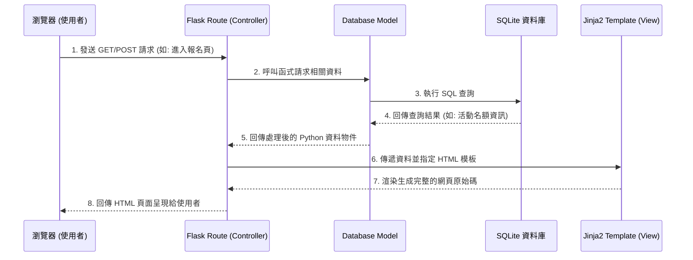

# 系統架構設計文件：活動報名系統

本文件基於 `docs/PRD.md` 的需求，規劃活動報名系統的技術架構與檔案結構。

## 1. 技術架構說明

本系統採用經典的後端渲染 (Server-Side Rendering) 架構，不進行前後端分離，以求快速開發與迭代，適合第一版 MVP (最小可行性產品) 的目標。

### 選用技術與原因
- **後端框架：Python + Flask**
  - **原因**：Flask 是輕量級且靈活的框架，學習曲線平緩，適合快速搭建以及中小型專案開發。
- **模板引擎：Jinja2**
  - **原因**：Flask 內建支援，能直接在 HTML 中使用 Python 語法撰寫邏輯處理（如利用迴圈印出活動列表或條件判斷使用者身分），降低開發的複雜度。
- **資料庫：SQLite**
  - **原因**：不需要額外設定伺服器環境，以單一檔案方式隨開即用。對於學生專案而言，在開發、除錯及部署上都極為方便。

### Flask MVC 模式說明
雖然 Flask 本身沒強制要求使用 MVC 模型，但為了便於維護與分工，本專案將以此思維切分檔案職責：
- **Model（模型）**：負責與 SQLite 進行溝通、資料庫存取與核心邏輯計算（例如確認活動容量、處理剩餘名額及候補判斷）。
- **View（視圖）**：由 Jinja2 處理 HTML 模板渲染，將後端資訊與前端框架組合成漂亮網頁後回傳給使用者。
- **Controller（控制器）**：由 Flask 的 Route (路由) 擔任此角色。負責接收使用者的網路請求，判斷需要哪些資料（向 Model 要資料），再將資料餵給對應的 Jinja2 模板（View）產出最終視窗。

---

## 2. 專案資料夾結構

為了讓團隊能清楚知道每個檔案的用途與位置，我們採用模組化切分明確的資料夾配置。

```text
web_app_development/
│
├── app/                        # 應用程式的主目錄
│   ├── __init__.py             # 建立並初始化 Flask app 實例
│   ├── models/                 # Model 層：存放資料表設定與邏輯
│   │   └── database.py         # 資料庫連線、Schema 與存取介面
│   ├── routes/                 # Controller 層：路由與業務邏輯
│   │   ├── events.py           # 負責活動瀏覽、建立、管理的路由
│   │   └── registrations.py    # 負責線上報名、取消、名單管理的路由
│   │
│   ├── templates/              # View 層：Jinja2 HTML 模板
│   │   ├── base.html           # 全站共同的網頁佈局 (Navbar, Footer 等)
│   │   ├── events/             # 活動相關頁面 (如活動列表頁、詳細頁)
│   │   └── registrations/      # 報名相關頁面 (如表單頁、名單管理頁)
│   │
│   └── static/                 # 靜態資源檔案
│       ├── css/                # 全域樣式表
│       └── js/                 # Javascript 輔助互動檔
│
├── instance/                   # 存放系統執行時產生的檔案
│   └── database.db             # 實際的 SQLite 資料庫檔案
│
├── docs/                       # 開發文件存放區
│   ├── PRD.md                  # 產品需求文件
│   └── ARCHITECTURE.md         # 系統架構設計文件 (本文)
│
├── app.py                      # 系統執行主入口
└── requirements.txt            # Python 套件相依清單
```

---

## 3. 元件關係圖

以下展示當使用者透過瀏覽器發送請求時，系統內部元件的交互關係。



---

## 4. 關鍵設計決策

以下為專案架構中影響後續開發決策的幾個重要選擇：

1. **路由資料夾切分 (Blueprint 藍圖機制)**
   - **問題**：若把全校報名系統的所有功能路由全寫在 `app.py` 中，將導致檔案過於龐大難以維護。
   - **決策**：利用 Flask 的 Blueprint 機制，將路由切分為 `events` (著重活動資訊) 與 `registrations` (著重報名與候補邏輯)。讓功能分流，降低後續多人開發時的版本衝突風險。

2. **採用交易機制 (Transaction) 應對高併發超賣**
   - **問題**：熱門活動可能會遇到剛好剩一位名額，但有兩人同時送出報名的情況發生。
   - **決策**：在 `Model` 層的 SQLite 查詢中加入關聯性交易（Transaction）檢查，確保新增報名資料前，會先即時鎖定並驗證剩餘容量。若滿額則無縫銜接到候補邏輯，確保人數限制機制的穩定性。

3. **不使用複雜的前端框架（例如 React / Vue）**
   - **問題**：團隊希望能快速驗證活動平台的產品價值，降低技術門檻。
   - **決策**：全面依賴 HTML / CSS 以及少許原生 JS，主要使用 Jinja2 控制動態畫面渲染。這將大幅降低不必要的前後端 API 傳遞與溝通成本，讓團隊專注在後端核心邏輯的成功率。

4. **安全性防線策略 (防禦 SQLi 與 XSS)**
   - **問題**：校園系統涉及真實學生的個資與聯絡資訊。
   - **決策**：Model 層面不論使用 SQLAlchemy 或原生 sqlite3，一律禁止直接拼接字串，改用「參數化查詢 (Parameterized Queries)」阻擋 SQL Injection。此外，利用 Jinja2 本身內建的「自動跳脫 (Autoescaping)」功能，攔截報名者輸入惡意程式碼引發的 XSS 攻擊。
