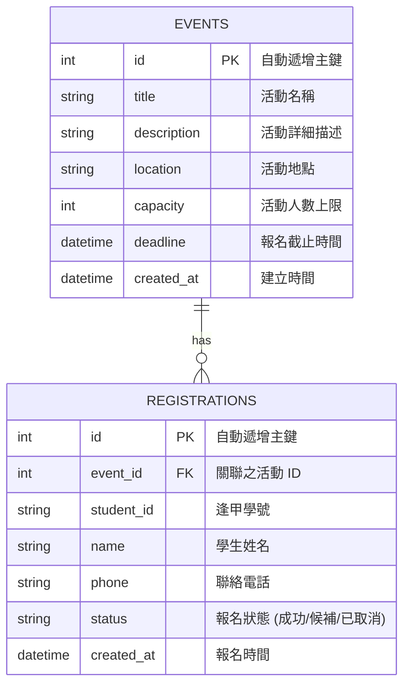

# 資料庫設計文件：活動報名系統

本文件基於 `docs/PRD.md` 與 `docs/FLOWCHART.md`，定義活動報名系統的 SQLite 資料表結構與關聯，以滿足系統對活動建立、報名與名單管理的需求。

## 1. ER 圖（實體關係圖）

本系統主要包含兩個資料表：`events`（活動資訊）與 `registrations`（報名紀錄），兩者為一對多的關係。

## 2. 資料表詳細說明

### 2.1 `events`（活動資料表）
負責記錄主辦方針對每個活動設定的詳細資訊，包含人數限制與報名截止日。

| 欄位名稱 | 型別 | 必填 | 說明 |
| :--- | :--- | :--- | :--- |
| `id` | INTEGER | 是 | Primary Key，系統自動遞增。 |
| `title` | TEXT | 是 | 活動的標題/名稱。 |
| `description` | TEXT | 否 | 活動詳細內文或注意事項。 |
| `location` | TEXT | 否 | 舉辦地點。 |
| `capacity` | INTEGER | 是 | 開放報名的人數上限（> 0）。 |
| `deadline` | DATETIME | 是 | 報名截止期限，超過此時間不接受報名。 |
| `created_at` | DATETIME | 是 | 該筆活動資料的建立時間，預設為 `CURRENT_TIMESTAMP`。 |

### 2.2 `registrations`（報名紀錄表）
記錄每一筆學生的報名資料，用於後續名單管理與候補機制對照。

| 欄位名稱 | 型別 | 必填 | 說明 |
| :--- | :--- | :--- | :--- |
| `id` | INTEGER | 是 | Primary Key，系統自動遞增。 |
| `event_id` | INTEGER | 是 | Foreign Key，關聯至 `events(id)`。 |
| `student_id` | TEXT | 是 | 逢甲大學學號，用以辨識身分。 |
| `name` | TEXT | 是 | 報名者姓名。 |
| `phone` | TEXT | 否 | 聯絡電話，主辦方需要時可聯絡。 |
| `status` | TEXT | 是 | 紀錄目前報名狀態，僅限輸入：`成功`、`候補`、`已取消`。 |
| `created_at` | DATETIME | 是 | 該筆報名的送出時間，用於判斷候補順序（預設 `CURRENT_TIMESTAMP`）。 |

## 3. SQL 建表語法

本專案將建表語法儲存於 `database/schema.sql` 檔案中，包含所有的 `CREATE TABLE` 指令與外鍵參考設定。

## 4. Python Model 程式碼

依照架構設計規劃，專案中的 Model 統一使用 `sqlite3` 與參數化查詢以防禦 SQL 注入：
- **共同連線**：統一透過 `app/models/database.py` 輔助取得 SQLite 連線。
- **活動管理 Model** (`app/models/event.py`)：提供活動的建立、更新、刪除等標準 CRUD。
- **報名管理 Model** (`app/models/registration.py`)：除了基本的讀寫外，其 `register()` 與 `cancel()` 方法實作了資料庫交易 (Transaction) 以防範超賣，並處理狀態遞補的業務邏輯。
