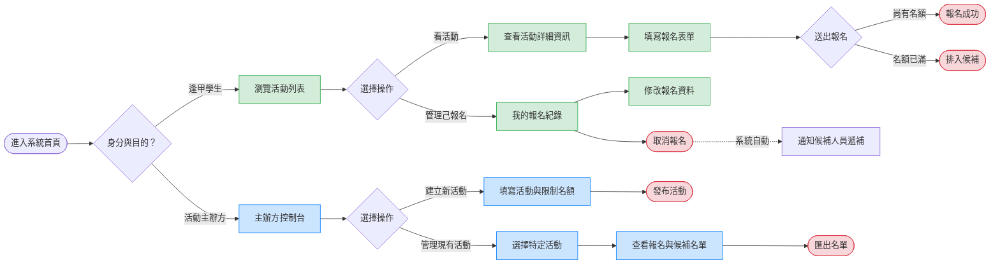
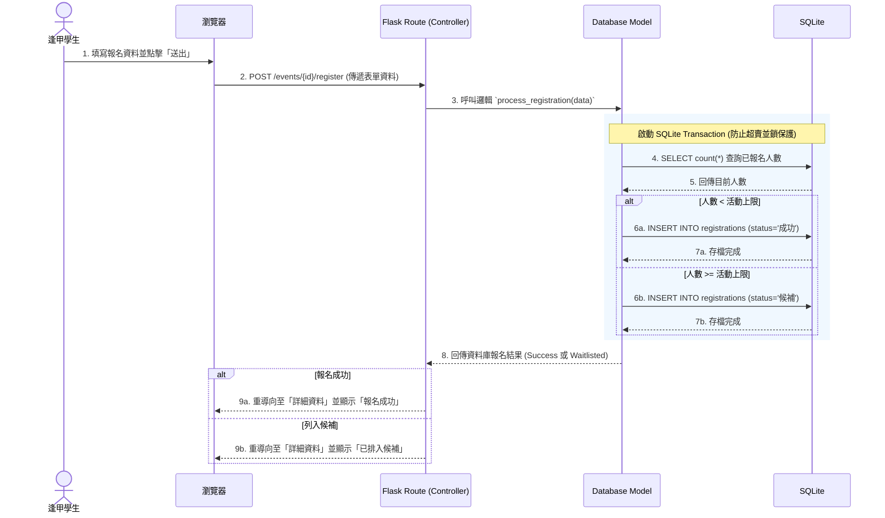

# 流程圖設計文件：活動報名系統

本文件基於 `docs/PRD.md` 與 `docs/ARCHITECTURE.md`，視覺化呈現系統的使用者操作路徑、系統資料交換流程，以及相關功能的對照表。

## 1. 使用者流程圖（User Flow）

此流程圖描述「逢甲學生（參與者）」與「活動主辦方」在進入系統後，各自可以進行的操作路徑與流程決策。

## 2. 系統序列圖（Sequence Diagram）

此序列圖詳細描繪了最核心也是問題最多的操作：**「使用者看中活動並送出報名表單」**，這中間系統各元件如何互動，包含防止超賣與自動候補的資料庫交易檢查流程。

## 3. 功能清單對照表

將上述流程對應到實際的 Flask 路由規劃中。

| 主要功能 | 說明 | URL 路徑 (Route) | HTTP 方法 (Method) |
| :--- | :--- | :--- | :--- |
| **首頁/活動列表** | 顯示目前所有可報名的活動清單 | `/` 或 `/events` | `GET` |
| **活動詳細資訊** | 顯示單一活動內容介紹、報名時間與剩餘名額 | `/events/<id>` | `GET` |
| **線上報名 (表單)** | 顯示該活動的報名填寫頁面 | `/events/<id>/register` | `GET` |
| **線上報名 (送出)** | 接收表單，進行名單邏輯處理（含候補判斷） | `/events/<id>/register` | `POST` |
| **建立新活動 (表單)**| 主辦方的建立新活動設定頁面 | `/events/create` | `GET` |
| **建立新活動 (送出)**| 接收新活動資料並存入資料庫 | `/events/create` | `POST` |
| **報名名單管理** | 主辦方查看該活動的報名、候補人員狀態 | `/events/<id>/registrations` | `GET` |
| **我的報名紀錄** | 學生總覽自己報名且有效或候補中的活動 | `/my/registrations` | `GET` |
| **修改報名資料** | 送出更新自己的聯絡資訊等 | `/registrations/<reg_id>/edit` | `POST` |
| **取消報名** | 放棄參與活動（後端會自動觸發另一位候補者遞補） | `/registrations/<reg_id>/cancel` | `POST` |

*(註：為簡潔，修改或取消動作皆使用 `POST` 搭配表單實現，以符合標準 HTML 無法直接送出 PUT/DELETE 的實作方式)*
